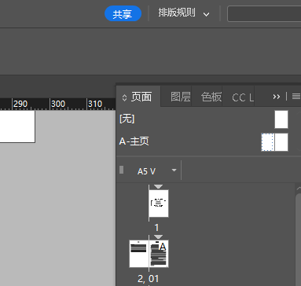
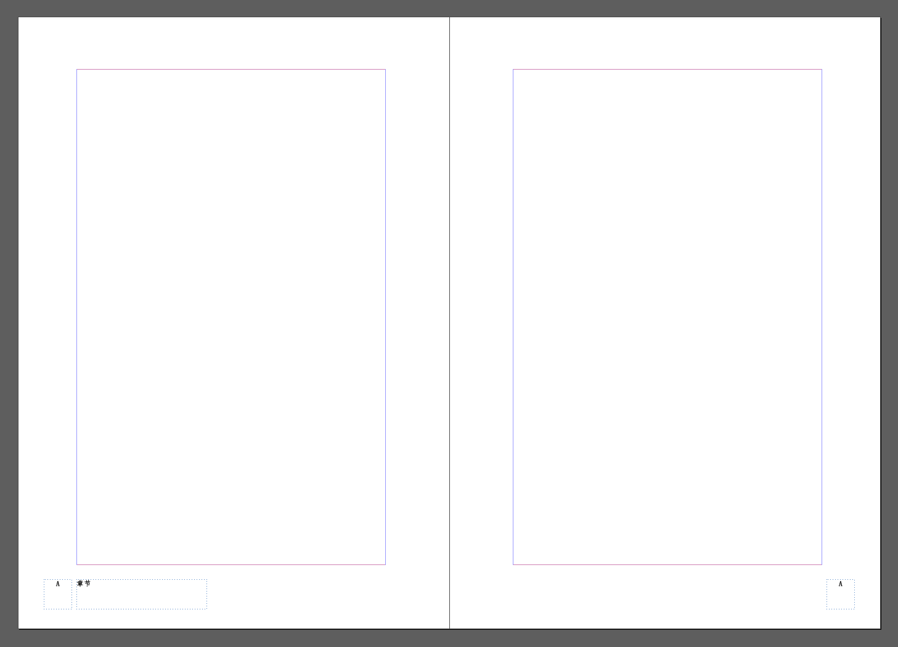
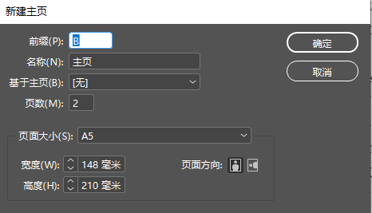
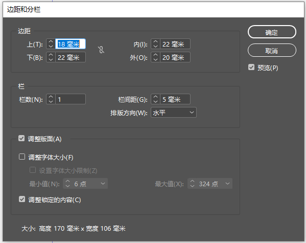
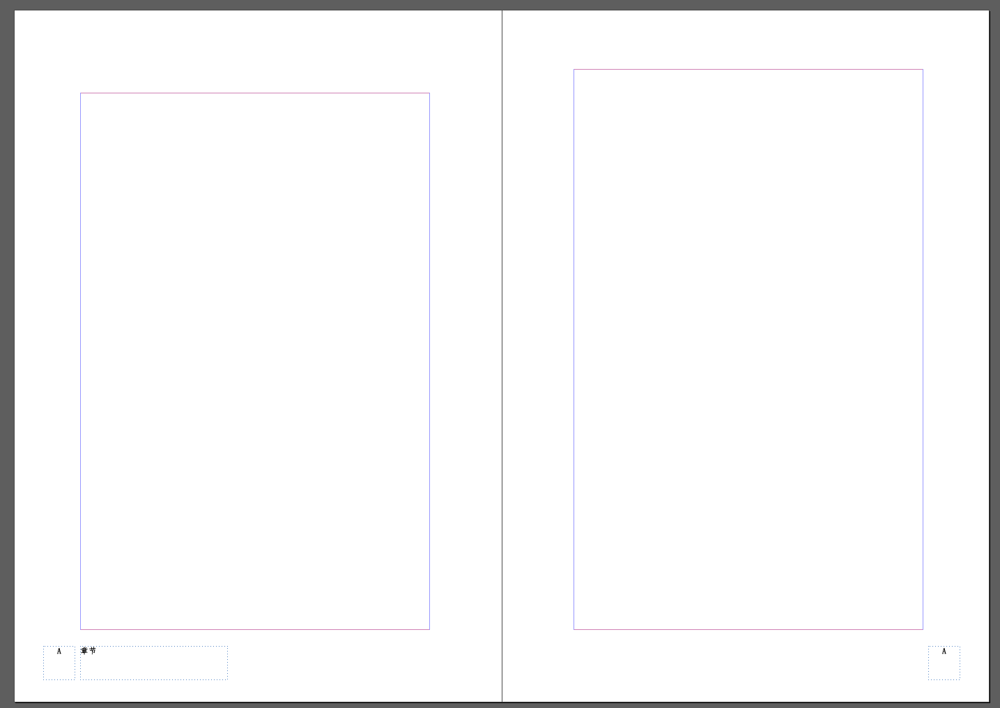
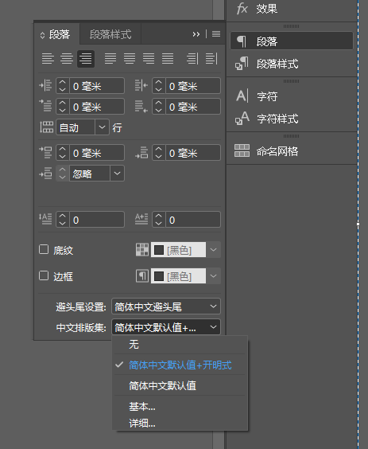
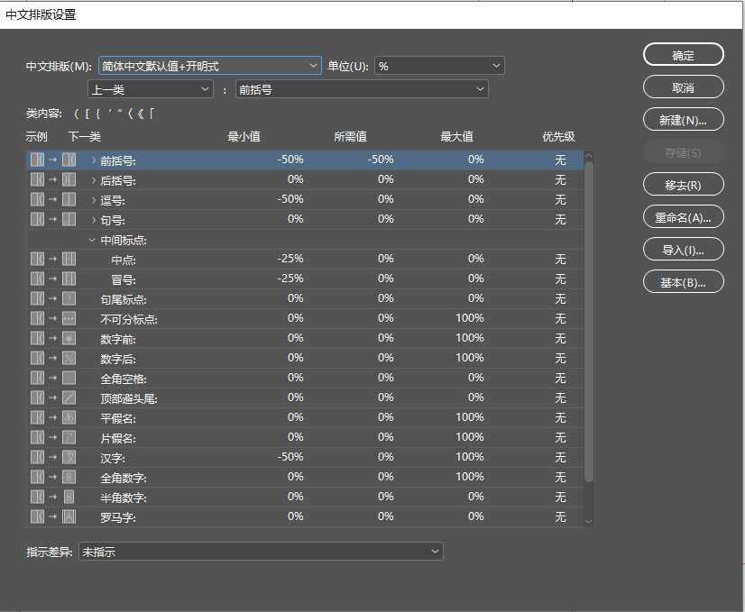
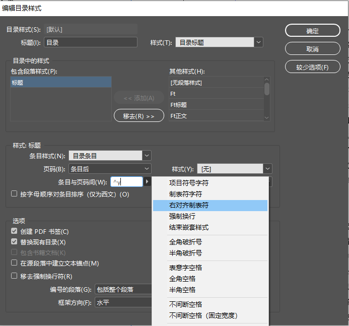
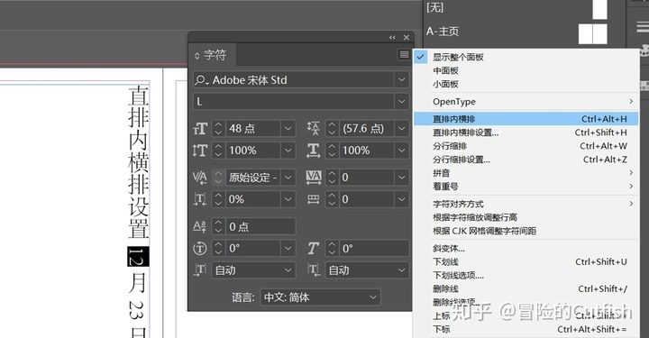

已经有很多专业人士写过各种新手向干货，我就不重复了，比如：

1. [【导航】同人制作小教室文章一览-同人本制作私人小教室](https://loveindesign.lofter.com/post/3d52ff_1c852e812)
2. [【教程】InDesign无料同人本排版傻瓜教程_哔哩哔哩_bilibili](https://www.bilibili.com/video/BV1fW411s7UG)
3. [【教程】多章节无料同人本排版 - InDesign傻瓜教程2_哔哩哔哩_bilibili](https://www.bilibili.com/video/BV1Fs411N7Y8)
4. [Indesign同人本排版傻瓜教程 第一弹-阿矾](https://afanvera.lofter.com/post/112bb7_14f56ea)

这篇文章主要总结了一些我在初次使用InDesign时候碰到的问题，希望能帮到各位从零上手的朋友。

## 页面设置
### 主页设置

简单来说，主页是用于普通页面的模板，拖拽到普通页面即可运用。在排版规则试图下打开【页面】，能看到有两种默认的主页，【无】和【A-主页】。

- 【无】：空模板，任何不想运用样式的页面，都可以用这个。

- 【A-主页】默认的主页，一般为左右两页，在上面添加的样式都会自动应用于使用该主页的普通页面。

悬浮鼠标可查看某个页面已经应用的主页样式。

【A-主页】的样式：

这是我添加了页码和章节号之后的主页，也就是所有使用这个主页的页面都会显示页码，且在左面显示章节符号

也可以新建主页并采用更多样式，比如你要做图文合志，那么可以图片页使用A主页，文字页使用B主页这样。

### 一次性调整页边距

比如一开始已经设定好了20mm的四边页边距，但是又想修改，应该怎么办呢？InDesign里文本框会自动适应版面大小，这里就需要选择主页再进行调整。【注意，以A-主页举例，两页都需要调整！】

选择主页的一面→菜单栏选择【边距和分栏】，修改边距（比如25mm）并勾选调整版面。这样左面就已经体现出了变化，对右面也做同样修改即可。

### 标点挤压

首先大家可以看这个视频了解一下为什么中日韩文（CJK文字，西文没有这种东西）排版需要考虑标点挤压，简单来说，就是两个及以上标点连续出现时，如果两个标点仍然都占一个标准字符位，版面就会显得松散难看。上诉傻瓜教程中提到标点挤压是大坑，但是实际情况中如果不做标点挤压真的有点难看，所以我还是选择临时抱佛脚了一下。

[调整标点，快速拯救你的排版。- oooooohmygosh_哔哩哔哩_bilibili](https://www.bilibili.com/video/BV1Lr4y127qp)

接下来是中文中“开明式”标点挤压的规则总结（不唯一，只是我用这个作为参考）

- 「1个结束夹注符」后面是：开始夹注符、结束夹注符、顿、逗、句(包括全宽句点）、冒、分，就挤。
- 「1个开始夹注符」后面是：开始夹注符，就挤。
- 「顿、逗、句（包括全宽句点）」后面是：开始夹注符、结束夹注符，就挤。
- 「分、冒」后面是：开始夹注符，就挤。

备注：成对出现的标点叫做夹注符，如双引号、书名号等；其中细分为开始夹注符与结束夹注符。

（来自：[https://www.uisdc.com/chinese-typesetting-3-principle](https://www.uisdc.com/chinese-typesetting-3-principle)）

根据以上规则设置标点挤压集：

在段落里找到【中文排版集】→详细→并新建一个中文排版集（这里的开明式就是我自己新建的）

打开的详细面板里，**上一类**指的选定的标点符号出现在左边，即控制与右边字符的距离；**下一类**则表示选定的字符与左侧字符的距离。然后根据上诉规则设置自己想要的挤压参数。

这里也有更详细的解说：[Indesign里标点挤压及首行缩进2字符设置](https://zhuanlan.zhihu.com/p/97274040)

### 目录格式

Q: 为什么我的目录里的章节名和页码中间没有空格，而是页码紧跟着章节?

A: 需要在目录样式中选择【右对齐制表符】

### 数字竖排内横排设置

打开字符小菜单的更多设置（三条线）

## 实用快捷键

- `W` - 一键隐藏所有辅助文本框，预览实际效果
- 小键盘的`Enter` - 分页/换页

## 保存现有文件为模版

> 自从做好一个文本排版并存成模版后，每次要做新本，我都直接用模版套，效率飞升！再也不用每次反复设置中英文混合字体大标题小标题正文脚注样式！✌️

1. 另存为→ 格式选择模版文件
2. 每次打开模板文件后都会新建一个文件，而非修改已经保存的文件夹。

## Indesign转曲
1. [Indesign中如何将文字转曲-百度经验](https://jingyan.baidu.com/article/0aa2237502403588cc0d64a8.html)
1. [indesign转曲教程-百度经验](https://jingyan.baidu.com/article/4dc4084881e8bdc8d946f1f9.html)

> 此处注意转曲只能用PDF1.3格式

## 字体字号磅数大小对照表

最后是字体字号磅数大小对照表，给和我一样缺乏相关知识需要拿手头的书参考字体大小的朋友们：
| 中文字号 | 英文字号（磅） | 毫米 | 像素 |
|-----------|----------------|------|------|
| 1英寸 | 72pt | 25.30mm | 95.6px |
| 大特号 | 63pt | 22.14mm | 83.7px |
| 特号 | 54pt | 18.97mm | 71.7px |
| 初号 | 42pt | 14.82mm | 56px |
| 小初 | 36pt | 12.70mm | 48px |
| 一号 | 26pt | 9.17mm | 34.7px |
| 小一 | 24pt | 8.47mm | 32px |
| 二号 | 22pt | 7.76mm | 29.3px |
| 小二 | 18pt | 6.35mm | 24px |
| 三号 | 16pt | 5.64mm | 21.3px |
| 小三 | 15pt | 5.29mm | 20px |
| 四号 | 14pt | 4.94mm | 18.7px |
| 小四 | 12pt | 4.23mm | 16px |
| 五号 | 10.5pt | 3.70mm | 14px |
| 小五 | 9pt | 3.18mm | 12px |
| 六号 | 7.5pt | 2.56mm | 10px |
| 小六 | 6.5pt | 2.29mm | 8.7px |
| 七号 | 5.5pt | 1.94mm | 7.3px |
| 八号 | 5pt | 1.76mm | 6.7px |

(banner by [Glen Carrie](https://unsplash.com/photos/a-close-up-of-a-book-with-letters-and-numbers--3O5DYv41fw))